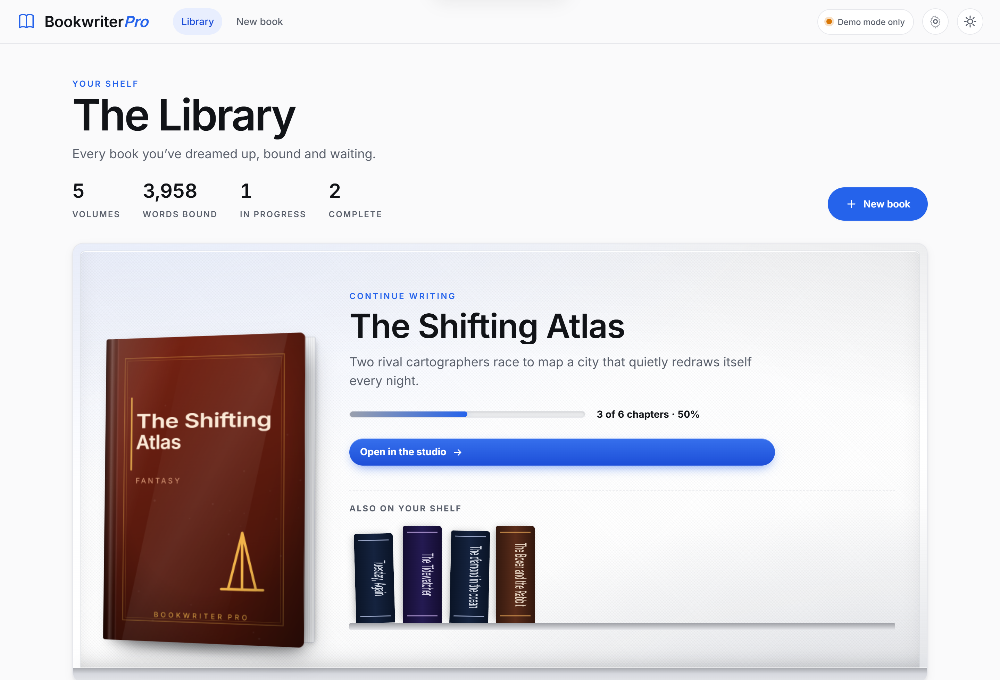
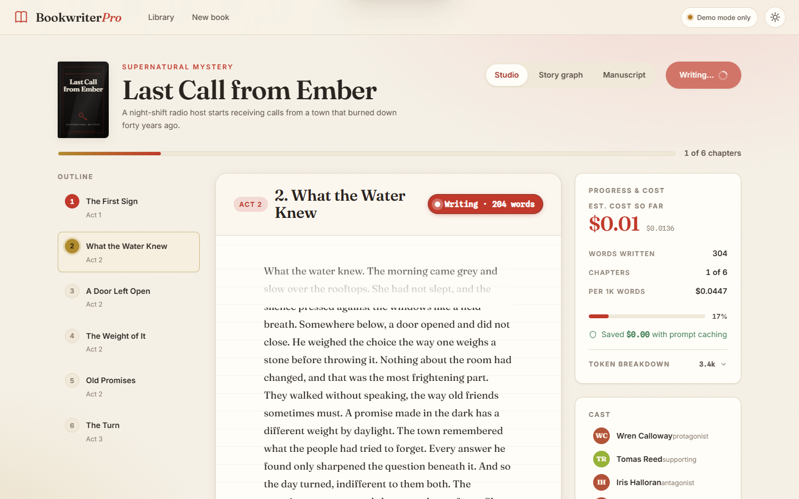
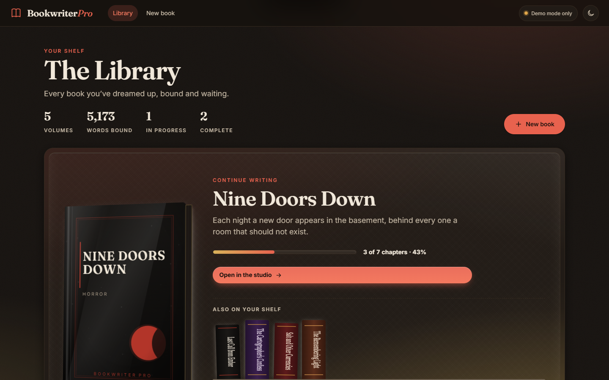
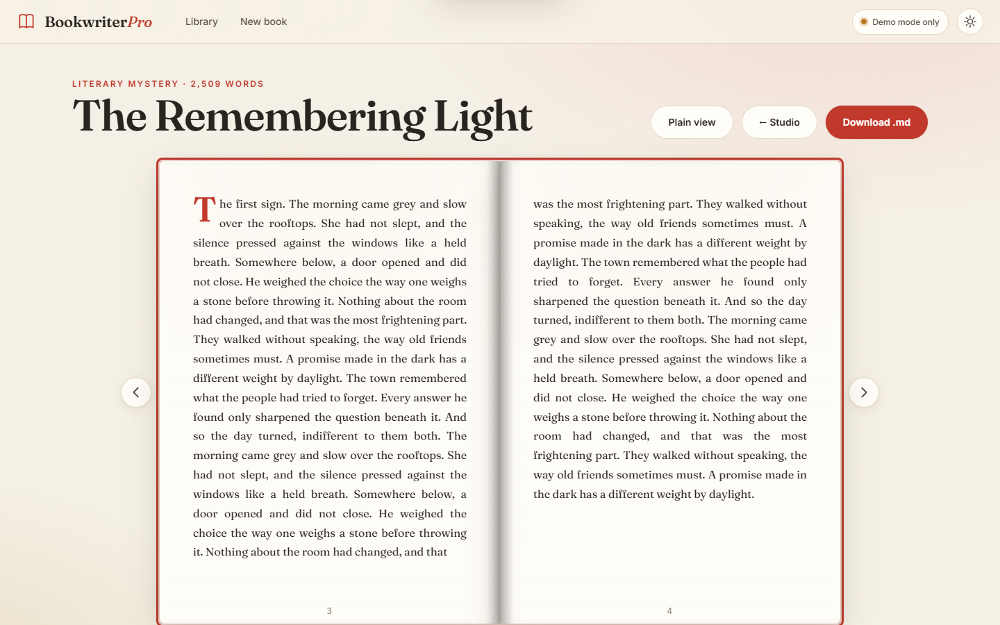
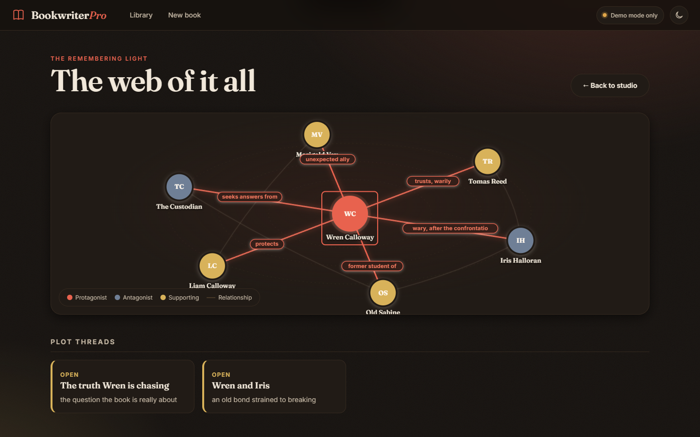
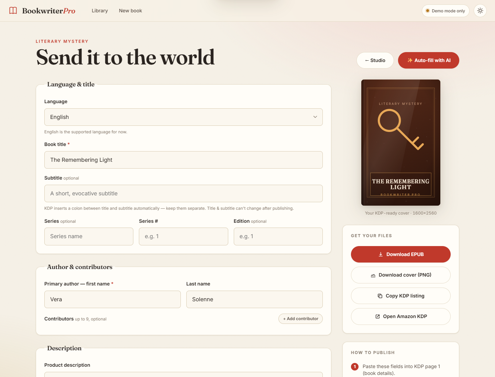

<div align="center">

# 📖 BookwriterPro

### Write an entire book with AI — and *watch it happen.*

**Type a premise. Watch the cover design itself as you type. Generate a whole novel chapter‑by‑chapter, live. Read it like a real book. Track every token.**

A local‑first book‑generation studio with a sleek, modern UI, an HTTP API, and a Model‑Context‑Protocol server — so a human *or an AI agent* can use it as a tool.


[](LICENSE)


[Quick start](#-quick-start-60-seconds) · [Features](#-why-youll-love-it) · [Use it as an agent tool](#-use-it-as-an-agent-tool-mcp) · [Architecture](#-how-it-works) · [The cost story](#-engineered-for-minimum-token-cost)

</div>

---

<div align="center">



*A bookshelf you actually want to browse — every cover is generated, not stock.*

</div>

<div align="center">

### 🪄 Your book cover designs itself as you type


*No stock art, no upload — a real procedural jacket forged live in the browser.*

</div>

## ✨ Why you'll love it

Most "AI writer" apps give you a chat box and a wall of text. BookwriterPro gives you a **studio**:

- 🪄 **Your book cover designs itself as you type.** Start a new book and a real, art‑directed jacket *forges live* beside the form — title typeset, genre‑driven palette, foil, spine, embossed motif. It's the kind of "wait, how?" moment that makes you lean in.
- ✍️ **Watch your book get written, live.** Chapters stream in **token‑by‑token** with a "Writing…" pulse — like watching an author at the keyboard, with a running word + cost meter.
- 📥 **Already have a draft? Import it.** Paste or drop in a `.txt`/`.md` manuscript and BookwriterPro splits it into chapters, **reverse‑engineers the story bible + continuity** from your prose, and opens it as a normal book you can then **edit by hand, revise with AI, continue (+N chapters), illustrate, and publish.**
- 📖 **Read it like a real book.** The finished manuscript opens into a **3D page‑turn reader** — two‑page spread, drop‑caps, page numbers, the works (with a plain‑scroll fallback).
- 🕸️ **See the story's web.** A live character‑relationship graph: clean at rest, revealing each character's ties on hover.
- 🔌 **Bring any model — or your *subscription*.** Pick the AI per book right in the setup modal: the Anthropic, OpenAI, or OpenRouter API — **or generate on your Claude / ChatGPT / Grok monthly subscription** with no API key and no per‑token billing.
- 🎨 **Illustrated chapters.** Flip one toggle and every chapter gets its own art, generated from the story bible — **defaulting to Pixio**, or any image API you like. Images land inline in the reader *and* embed straight into the EPUB.
- ⌨️ **⌘K everything.** A Linear/Raycast‑class command palette to jump anywhere.
- 🌗 **Gorgeous in light *and* dark.** A sleek, minimal design — neutral surfaces, one confident accent, crisp type — with a true dark theme, not a lazy invert. Fully responsive down to mobile.
- 🤖 **An agent can drive the whole thing** — write *and* publish — via 24 MCP tools or a clean HTTP/OpenAPI API.

> A panel of independent design critics scored the rendered UI a **9/10 — "a polished, premium, shipped product."**

<div align="center">

| Watch chapters stream live | Light *and* dark, both first‑class |
|---|---|
|  |  |
| **Read it like a real book** | **Trace the story's web** |
|  |  |

</div>

---

## 🚀 Quick start (60 seconds)

> Requires **Python 3.10+**. No build step, no Node, no database.

```bash
git clone https://github.com/RealDealCPA-VR/BookwritterPro.git
cd BookwritterPro

# install the web server extras
pip install -e ".[server]"

# launch the studio
python -m bookwriter.serve          # or:  bookwriter-serve
```

Open **http://127.0.0.1:8000** → hit **New book** → start typing and **watch the cover forge itself**.

**No API key? No problem.** With no `ANTHROPIC_API_KEY` set, the app runs in **Demo mode** (a built‑in mock model — zero spend, zero network) so the *entire* experience works out of the box. When you're ready for real prose:

```bash
export ANTHROPIC_API_KEY=sk-ant-...   # Windows: setx ANTHROPIC_API_KEY "sk-ant-..."
python -m bookwriter.serve
```

…then toggle **Demo mode off** in the composer.

---

## 🔌 Bring your own model — or your subscription

Every book is configured in a **Create AI Book** setup panel — chapters, length, style, audience, book type — and crucially, **which AI writes it**. Choose per book:

| Backend | What it uses | How |
|---|---|---|
| **Anthropic** | Claude via the API | `ANTHROPIC_API_KEY` |
| **OpenAI** | GPT via the API | `OPENAI_API_KEY` |
| **OpenRouter** | one key, dozens of models | `OPENROUTER_API_KEY` |
| **Claude subscription** | `claude -p` (Claude Code) | Pro/Max login — *no API key* |
| **ChatGPT subscription** | `codex exec -` (Codex CLI) | Plus/Pro login — *no API key* |
| **Grok** | `grok --prompt` (Grok CLI) | xAI key (`GROK_API_KEY`) in the CLI's env |
| **Any other model** | a custom CLI, or any OpenAI‑compatible endpoint | `BOOKWRITER_CLI_CMD`, or `OPENAI_BASE_URL` |

```bash
# write on your Claude Pro/Max subscription instead of paying per token
export BOOKWRITER_LLM_PROVIDER=claude-cli      # needs the `claude` CLI, logged in
python -m bookwriter.serve
```

The subscription backends shell out to each vendor's signed‑in CLI, so generation rides your **flat monthly plan** — the live cost meter reads **$0/token** for those, and the prose stages honor the exact model you pick while the cheap continuity stages stay cheap.

---

## 🎨 Illustrated chapters

Flip **Add chapter images** in the setup panel and BookwriterPro generates one illustration per chapter as it writes — prompted from the **story bible** (POV character's look, the scene's location, the chapter's mood), so the art stays on‑model with the book. Pictures appear inline in the **live reader** and the **3D page‑turn manuscript**, and embed straight into the exported **EPUB**.

It **defaults to Pixio** (just set a key) and lets you swap in *any* image API:

```bash
export PIXIO_API_KEY=pxio_live_...             # the default — that's it
# …or point at anything else:
export BOOKWRITER_IMAGE_PROVIDER=openai        # OpenAI Images (uses OPENAI_API_KEY)
export BOOKWRITER_IMAGE_PROVIDER=http          # ANY HTTP image API (set BOOKWRITER_IMAGE_URL …)
```

Image generation is **best‑effort**: if a key is missing or a call fails, the chapter is written without an image — never blocking your prose.

---

## 🤖 Use it as an agent tool (MCP)

BookwriterPro speaks the **Model Context Protocol**, so Claude Desktop, Claude Code, or any MCP client can write books for you:

```bash
pip install -e ".[mcp]"
python -m bookwriter.mcp_server     # stdio MCP server
```

**24 tools**, all sharing the same data store as the web app (a book an agent creates shows up in the UI, and vice‑versa):

`list_profiles` · `list_books` · `create_book` · `import_book` · `write_book` · `write_chapter` · `edit_chapter` · `revise_chapter` · `add_chapters` · `get_status` · `get_chapter` · `get_graph` · `get_cost` · `get_manuscript` · `prepare_kdp` · `export_epub` · `export_docx` · `print_spec` · `estimate_royalties` · `generate_marketing` · `get_kdp_listing` · `generate_cover` · `generate_back_cover` · `export_pdf`

Claude Desktop config and details: **[`docs/MCP.md`](docs/MCP.md)**.

Prefer plain HTTP? The same engine is a **FastAPI/OpenAPI** service with live **Server‑Sent Events** streaming — interactive docs at **`/docs`** when the server is running.

---

## 🖥️ Or drive it from the CLI

```bash
# Plan + write a whole book end-to-end
python -m bookwriter generate \
  --premise "A lighthouse keeper discovers the nightly fog is erasing the town's memories." \
  --chapters 12 --genre "literary mystery" --project ./lighthouse

# Try the full pipeline offline first — no key, no spend:
python -m bookwriter generate --premise "test" --chapters 3 --project ./demo --mock

python -m bookwriter profiles        # see model tiers + pricing
python -m bookwriter report --project ./lighthouse   # cost + progress
```

Generation is **resumable** — it saves after every chapter, so an interrupted run picks up where it left off.

---

## 📤 Publish to Amazon KDP — fast

<div align="center">



</div>

Go from finished manuscript to a **ready-to-upload KDP listing in minutes.** Hit **Publish to KDP** in the studio and BookwriterPro builds the whole kit — **eBook *and* paperback**:

- **✨ Auto-fill EVERY field with AI** — description, **back‑cover blurb**, **author bio**, up to **7 keyword‑rules‑compliant keywords**, up to **3 categories**, subtitle, series/series‑part/edition, reading age — all from the book, all editable, with live counters and inline validation.
- **🖼️ Generate a catchy AI cover** — one click paints art‑directed cover artwork from your story via the image backend (**Pixio** by default), with your title & author typeset on top — and a **matching back cover** (blurb + author bio + imprint) is generated too.
- **📄 Download the book as a PDF** — four exports for the author: **full book** (cover + interior + back cover), **interior only** (no cover), **front cover**, and **back cover**. *(Needs the optional `[pdf]` extra: `pip install -e ".[pdf]"`.)*
- **📗 eBook** — a valid **EPUB** (pure‑stdlib builder: proper `mimetype`, nav/TOC, embedded cover; uploads straight to KDP) and a **KDP‑ready cover** exported to a high‑res PNG (~2560px) right in the browser.
- **📕 Paperback** — a print‑ready **6×9 DOCX interior** plus a computed **print spec** (estimated page count, spine width, full‑wrap cover dimensions) and a print‑cover SVG to start from.
- **💵 Pricing & royalties** — type a list price and see estimated **eBook (70%/35%)** and **paperback** royalties per sale (printing cost included) for your marketplace.
- **📣 Marketing copy** — one click generates **back‑cover blurb variants, A+ content modules, an author bio, and taglines** (pick a blurb → it fills your description).
- **A copy‑paste listing** + a step‑by‑step **CHECKLIST.md**, one‑click **Open Amazon KDP**, and a built‑in tip for the `StorytellerUK2026` contest keyword.

Prefer the terminal or an agent?

```bash
# CLI: build the full KDP kit (EPUB + DOCX + cover + listing + marketing) into ./book/kdp/
python -m bookwriter kdp   --project ./book --author-first Vera --author-last Solenne
python -m bookwriter price --project ./book --list-price 4.99      # royalty estimate

# Or hit the API directly
curl -OJ "http://127.0.0.1:8000/api/books/<id>/export/epub?download=1"   # eBook
curl -OJ "http://127.0.0.1:8000/api/books/<id>/export/docx?download=1"   # paperback interior
```

Agents can do all of it — the MCP server exposes `prepare_kdp`, `export_epub`, `export_docx`, `print_spec`, `estimate_royalties`, `generate_marketing`, and `get_kdp_listing`.

> KDP has no public publishing API, so the final upload is yours to click — but everything you need is generated and waiting.

---

## 💸 Engineered for minimum token cost

This isn't just pretty — it's **cheap to run**, by design. Naïve book generators re‑send every prior chapter into every new one (cost grows quadratically). BookwriterPro keeps per‑chapter cost roughly **flat**:

- **A committed story graph** (characters, locations, plot threads, timeline) is the single source of truth — the engine never re‑reads old prose.
- **Prompt‑cached "bible" spine** — the stable spine of the book is sent as a `cache_control` prefix, read at **~0.1×** on every chapter.
- **Bounded rolling synopsis** instead of an ever‑growing transcript.
- **Model tiering** — a capable model writes prose; the cheapest model handles mechanical extraction/continuity.
- **Every call is metered** — the studio shows live `$`, `$/1k words`, and exact prompt‑cache savings.

> Inspired by the knowledge‑graph + deterministic‑fingerprinting approach of [Understand‑Anything](https://github.com/Egonex-AI/Understand-Anything), applied to long‑form fiction so characters and plot stay consistent across dozens of chapters.

---

## 🏗️ How it works

```
premise ──▶ Planner ──▶ Story Bible + Continuity Graph  (committed JSON, shared)
                              │
       ┌──────────────────────┴───────────────────────┐
       ▼                                                │
  Chapter Writer  ◀── cached bible prefix (~0.1× reads) ┤
       │            streams tokens live (SSE)           │
       ▼                                                │
  Extractor (cheap model) ──▶ structured state delta ───┘
       │                       merged into the graph
       ▼
  Continuity Checker ──▶ flags
```

Three surfaces over one engine: a **vanilla, no‑build web SPA**, a **FastAPI HTTP/SSE API**, and an **MCP server**. Full write‑up in **[`docs/ARCHITECTURE.md`](docs/ARCHITECTURE.md)**.

---

## 🚢 Running it in production

BookwriterPro is **local‑first and single‑user by design** — it ships no authentication. A few rules keep that safe:

- **It binds `127.0.0.1` by default.** It **refuses** a non‑local bind unless you opt in:

  ```bash
  # exposing it to a network requires an explicit opt-in AND your own auth in front
  BOOKWRITER_ALLOW_REMOTE=1 BOOKWRITER_HOST=0.0.0.0 python -m bookwriter.serve
  ```

  Only do this **behind a reverse proxy that adds authentication and TLS** — anyone who can reach the app can spend your tokens, read/change settings, and delete books.
- **Run a single process.** Live state (the SSE broker, the one‑job‑per‑book lock, the settings store) lives in memory, so do **not** run multiple uvicorn/gunicorn workers — they'd split that state. Scale by running one process per user, not one process with N workers.
- **Secrets stay local.** API keys entered in **Settings** are written to `<data_dir>/settings.json` (`.bookwriter_data/`, git‑ignored), masked in the API, and never logged or returned in full. On a shared host, lock down the data dir's permissions.
- **Requests are bounded** (chapter count, words/chapter, premise length) so a single call can't trigger runaway spend, and chapter prose is persisted **before** the cheap continuity stages run, so a bad model response never discards a paid‑for chapter — interrupted runs resume cleanly.
- **Logging:** set `BOOKWRITER_LOG_LEVEL=DEBUG` for verbose server logs (default `INFO`). Background write‑job failures are always logged with a full traceback.

| Variable | Default | Purpose |
|---|---|---|
| `BOOKWRITER_HOST` / `BOOKWRITER_PORT` | `127.0.0.1` / `8000` | bind address |
| `BOOKWRITER_ALLOW_REMOTE` | unset | required to bind a non‑local host |
| `BOOKWRITER_DATA_DIR` | `./.bookwriter_data` | where books + `settings.json` live |
| `BOOKWRITER_LOG_LEVEL` | `INFO` | server log verbosity |
| `BOOKWRITER_LLM_PROVIDER` | `anthropic` | default backend (`anthropic`/`openai`/`openrouter`/`claude-cli`/`codex`/`grok-cli`/`cli`) |

Install with capped, reproducible dependencies; for a locked deploy, layer a `pip freeze` constraints file on top of the floors in `requirements*.txt`.

---

## 🧪 Tested & solid

```bash
python -m pytest -q                       # 144 tests, runs fully offline (mock model)
```

The whole package imports and its test suite runs with **zero third‑party installs** (the LLM client is mockable). Server/MCP tests skip cleanly if those extras aren't installed.

---

## 📁 Project layout

```
bookwriter/
  config.py      model tiers, pricing, quality profiles
  pipeline.py    orchestration (plan → write → extract → check), live events
  graph.py       the continuity knowledge graph
  llm.py         Anthropic client (prompt caching, streaming, cost tracking)
  mock.py        offline MockLLM (demo mode + tests)
  server/        FastAPI app, service layer, SSE event broker
  serve.py       `python -m bookwriter.serve`
  mcp_server.py  MCP stdio server (24 tools)
  web/           the studio UI (index.html, styles.css, app.js, covers.js, palette.js, kdp.js)
docs/            ARCHITECTURE.md · MCP.md · screenshots/
tests/           144 offline tests
```

---

## ⚙️ Configuration

| What | How |
|---|---|
| Real generation | `ANTHROPIC_API_KEY` (else Demo/mock mode) |
| LLM backend | `BOOKWRITER_LLM_PROVIDER` — `anthropic` (default) · `openai` · `openrouter` · `claude-cli` · `codex` · `grok-cli` |
| Per‑tier models | `BOOKWRITER_MODEL_STRONG` / `_MID` / `_CHEAP` (for non‑Anthropic backends) |
| Chapter images | `BOOKWRITER_IMAGE_PROVIDER` — `pixio` (default, `PIXIO_API_KEY`) · `openai` · `http` |
| Where books live | `BOOKWRITER_DATA_DIR` (default `./.bookwriter_data`) |
| Server host/port | `BOOKWRITER_HOST` / `BOOKWRITER_PORT` (default `127.0.0.1:8000`) |
| Quality profile | `premium` · `balanced` (default) · `draft` — `bookwriter profiles` |

> See [`.env.example`](.env.example) for every knob — provider keys, subscription‑CLI commands, and image‑provider settings.

---

## 🛠️ Built with

Pure **Python 3** + **FastAPI** + the **Anthropic SDK** on the backend; **zero‑dependency vanilla HTML/CSS/JS** on the frontend (no framework, no build). The book covers are generated procedurally as inline SVG — no image assets.

<div align="center">

**Type a premise. Get a book. Watch every word of it happen.**

⭐ Star it if BookwriterPro made you smile.

</div>
